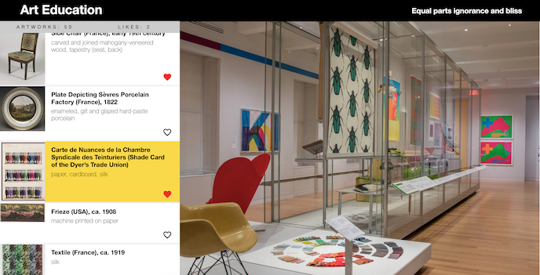

#Art Education
This project is to give the user a chance to learn about artworks in the Cooper-Hewitt collections. The Cooper Hewitt, Smithsonian Design Museum, located in New York City, is the only museum in the nation devoted exclusively to historic and contemporary design. It is the mission of Cooper-Hewitt’s staff and board of trustees to advance the public understanding of design across the 240 years of human creativity represented by the museum’s collection. For more information on the museum: https://siarchives.si.edu/history/cooper-hewitt-national-design-museum

This project was bootstrapped with [Create React App](https://github.com/facebookincubator/create-react-app) and uses the [Cooper Hewitt API](https://collection.cooperhewitt.org/api/).

